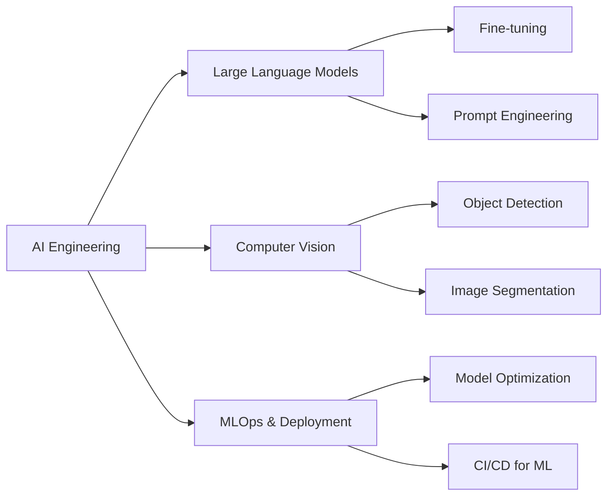

<div align="center">

# 🤖 JATIN GUPTA

[](https://git.io/typing-svg)


[](https://www.linkedin.com/in/jatin-gupta)
[](https://yourportfolio.com)
[](mailto:your.email@example.com)

</div>

---

## 🧠 About Me

```python
class AIEngineer:
    def __init__(self):
        self.name = "Jatin Gupta"
        self.role = "AI Engineer"
        self.location = "India"
        self.passions = [
            "Machine Learning",
            "Deep Learning", 
            "Computer Vision",
            "Natural Language Processing"
        ]
        
    def say_hi(self):
        print("Thanks for dropping by! Let's build something amazing together!")

me = AIEngineer()
me.say_hi()
```

🔬 Passionate about creating intelligent systems that solve real-world problems  
🎯 Specialized in ML/DL model development, deployment, and optimization  
🌱 Currently exploring advanced AI architectures and MLOps practices  
⚡ Always eager to collaborate on innovative AI projects

---

## 🛠️ Tech Arsenal

<div align="center">

### 🤖 AI/ML Frameworks


### 💾 Data Science


### 💻 Programming Languages


### ☁️ Cloud & MLOps


### 🛢️ Databases


### 🔧 Tools & IDEs


</div>

---

## 🚀 Featured Projects

<div align="center">

<table>
<tr>
<td width="50%">

### 🎬 Movie Savvy
Intelligent movie recommendation system using collaborative filtering and content-based approaches.

**Tech:** Python • Pandas • Scikit-learn • Flask

[](https://github.com/MaverickDev-J/Movie_savvy)

</td>
<td width="50%">

### 🚢 Titanic Survival Prediction
ML model predicting passenger survival with 82% accuracy using ensemble methods.

**Tech:** Python • XGBoost • EDA • Feature Engineering

[](https://github.com/MaverickDev-J/codsoft_1)

</td>
</tr>
<tr>
<td width="50%">

### 🎥 Movie Rating Prediction
Advanced regression model for predicting movie ratings based on multiple features.

**Tech:** Python • Random Forest • Deep Learning

[](https://github.com/MaverickDev-J/codsoft_2)

</td>
<td width="50%">

### 💳 Credit Card Fraud Detection
Anomaly detection system identifying fraudulent transactions with high precision.

**Tech:** Python • Isolation Forest • Neural Networks

[](https://github.com/MaverickDev-J/codsoft_5)

</td>
</tr>
</table>

</div>

---

## 📊 GitHub Analytics

<div align="center">
  


</div>

<div align="center">

[](https://git.io/streak-stats)

</div>

<div align="center">
  


</div>

---

## 🏆 Achievements & Certifications

<div align="center">

```
🎓 Machine Learning Specialization - DeepLearning.AI
🎓 Deep Learning Specialization - DeepLearning.AI  
🎓 TensorFlow Developer Certificate - TensorFlow
🏅 CodSoft AI/ML Internship - Completed with Excellence
🏅 Kaggle Competitions - Active Participant
```

</div>

---

## 📈 Contribution Graph

<div align="center">

[](https://github.com/MaverickDev-J)

</div>

---

## 🎯 Current Focus

<div align="center">



</div>

---

## 💡 Fun Facts

<div align="center">

🧩 I believe AI is not about replacing humans, but augmenting human capabilities  
🎮 When not coding, you'll find me exploring new AI research papers  
☕ Coffee + Code + AI = Perfect Day  
🌍 Open to collaborating on innovative AI projects worldwide  
📚 Currently reading: Latest papers on Transformer architectures

</div>

---

## 🤝 Let's Connect!

<div align="center">

### 💬 I'm always interested in discussing:
- 🤖 AI/ML project collaborations
- 🔬 Research opportunities
- 💼 Career opportunities in AI
- 🎓 Knowledge sharing and mentorship


### 📫 Reach Out:
[](https://www.linkedin.com/in/jatin-gupta)
[](mailto:your.email@example.com)
[](https://twitter.com/yourhandle)

</div>

---

<div align="center">

### ⭐ "The best way to predict the future is to invent it." - Alan Kay


</div>
