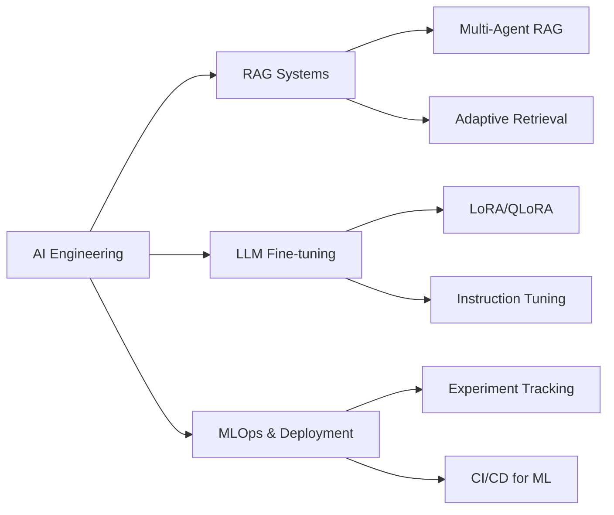

<div align="center">

# 🤖 JATIN GUPTA

[](https://git.io/typing-svg)


[](https://www.linkedin.com/in/jatin-gupta)
[](mailto:jatinniteshgupta642@gmail.com)

</div>

---

## 🧠 About Me

```python
class AIEngineer:
    def __init__(self):
        self.name = "Jatin Gupta"
        self.role = "AI Engineer"
        self.location = "India"
        self.specializations = [
            "RAG Systems & LLM Fine-tuning",
            "MLOps & Experiment Tracking",
            "Machine Learning Pipelines",
            "Computer Vision & NLP"
        ]
        
    def current_focus(self):
        return {
            "learning": ["LangGraph", "Advanced RAG Architectures", "LLM Optimization"],
            "building": ["Production-grade AI Systems", "MLOps Workflows"],
            "exploring": ["Agentic AI", "Multi-modal Systems"]
        }

me = AIEngineer()
```

🔬 Passionate AI Engineer focused on building production-ready intelligent systems  
🎯 Specialized in RAG architectures, LLM fine-tuning, and end-to-end ML pipelines  
🌱 Experienced with modern MLOps tools: DVC, MLflow, DagsHub for experiment tracking  
⚡ Building adaptive AI systems that solve real-world entertainment and business problems

---

## 🛠️ Tech Arsenal

<div align="center">

### 🤖 LLM & RAG Frameworks


### 🤖 AI/ML Frameworks


### 🗂️ Vector Databases & Search


### 📊 MLOps & Experiment Tracking


### 💾 Data Science


### 💻 Programming Languages


### ☁️ Cloud & Deployment


### 🛢️ Databases


### 🔧 Tools & IDEs


</div>

---

## 🚀 Featured Projects

<div align="center">

<table>
<tr>
<td width="50%">

### 🎬 Movie Savvy RAG
Advanced RAG system with fine-tuned Mistral 7B for entertainment queries. Features FAISS vector store, Reddit integration, and MLflow tracking for embedding optimization.

**Tech:** Mistral 7B • LitGPT • FAISS • MLflow • DVC • Reddit API

**Highlights:**
- Fine-tuned on 300K instruction pairs
- Multi-source retrieval (vector DB + Reddit)
- Embedding model evaluation with MLflow

[](https://github.com/MaverickDev-J/Movie_savvy)

</td>
<td width="50%">

### 🎥 Movie Savvy RAG 2.0
Adaptive RAG system with Mistral-7B-Instruct-v0.3, dynamic intent classification, and multi-source integration (FAISS, Web Search, YouTube transcripts).

**Tech:** Mistral-7B-Instruct • FAISS • Tavily API • YouTube API • MLflow

**Highlights:**
- Adaptive retrieval based on query intent
- YouTube transcript analysis
- Semantic content scoring & refinement
- MLflow experiment tracking for optimization

[](https://github.com/MaverickDev-J/Movie_Savvy_2.0)

</td>
</tr>
<tr>
<td width="50%">

### 🚗 Uber Demand Prediction
End-to-end ML pipeline for Uber ride demand forecasting with complete MLOps infrastructure including DVC pipelines and AWS deployment.

**Tech:** Python • Scikit-learn • DVC • AWS • Docker • GitHub Actions

**Highlights:**
- Complete MLOps pipeline with DVC
- AWS deployment with CI/CD
- Reproducible experiments
- Docker containerization

[](https://github.com/MaverickDev-J/Uber-Demand-Prediction)

</td>
<td width="50%">

### 💡 More Projects Coming Soon
Currently working on:
- Multi-agent RAG systems with LangGraph
- LLM fine-tuning experiments
- Production ML pipelines

</td>
</tr>
</table>

</div>

---

## 📊 GitHub Analytics

<div align="center">
  


</div>

<div align="center">

[](https://git.io/streak-stats)

</div>

<div align="center">
  


</div>

---

## 📈 Contribution Graph

<div align="center">

[](https://github.com/MaverickDev-J)

</div>

---

## 🎯 Current Focus

<div align="center">



</div>

---

## 🤝 Let's Connect!

<div align="center">

### 💬 Open to discussing:
- 🤖 RAG systems and LLM architectures
- 🔬 AI/ML project collaborations
- 💼 Career opportunities in AI Engineering
- 🎓 Knowledge sharing and mentorship


### 📫 Reach Out:
[](https://www.linkedin.com/in/jatin-gupta)
[](mailto:jatinniteshgupta642@gmail.com)

</div>

---

<div align="center">


</div>
